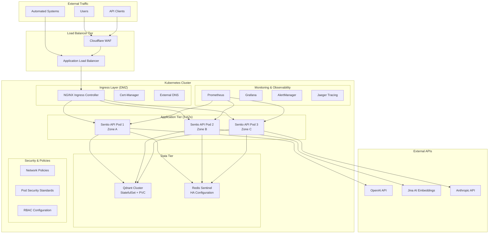
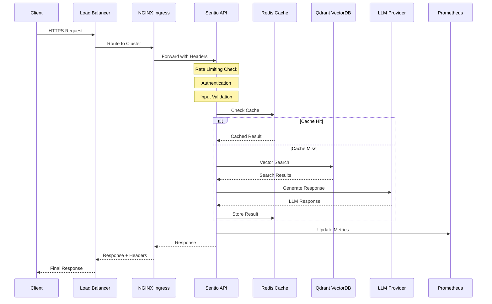

# Sentio vNext - Production Deployment Guide

> **Enterprise-Grade RAG System Deployment on Kubernetes**

## Overview

This guide covers the complete deployment of Sentio vNext RAG system for **production workloads**. The deployment architecture is designed for **high availability**, **auto-scaling**, and **zero-downtime operations** with comprehensive **observability** and **security hardening**.

## Deployment Architecture

### Production Topology



### Service Communication Flow



---

## Prerequisites & Planning

### Infrastructure Requirements

| Component | Minimum | Recommended | Enterprise |
|-----------|---------|-------------|------------|
| **Kubernetes Version** | 1.24+ | 1.28+ | 1.29+ |
| **Node Count** | 3 | 5 | 10+ |
| **Node Specs** | 4 CPU, 8GB RAM | 8 CPU, 16GB RAM | 16 CPU, 32GB RAM |
| **Storage** | 100GB SSD | 500GB NVMe | 2TB NVMe + Backup |
| **Network** | 1Gbps | 10Gbps | 25Gbps+ |

### External Dependencies

- **API Keys Required**:
  - OpenAI API key (GPT-4/3.5 Turbo)
  - Jina AI API key (Embeddings)
  - Anthropic API key (Claude, optional)
  - Qdrant Cloud credentials (or self-hosted)

- **DNS & Certificates**:
  - Domain ownership verification
  - Cloudflare account (recommended)
  - Let's Encrypt cert-manager setup

- **Monitoring**:
  - External monitoring service (DataDog, New Relic, etc.)
  - Log aggregation service (ELK, Splunk, etc.)
  - Alert notification channels (PagerDuty, Slack, etc.)

---

## Deployment Strategies

### Strategy 1: Quick Production Deploy (30 minutes)

**Use Case**: Small to medium workloads, getting started quickly

```bash
# 1. Clone and configure
git clone https://github.com/chernistry/sentio-vnext.git
cd sentio-vnext

# 2. Set up secrets
./deploy/scripts/setup-secrets.sh

# 3. Deploy everything
kubectl apply -k deploy/kubernetes/

# 4. Wait for rollout
kubectl rollout status deployment/sentio-rag -n sentio-rag --timeout=600s

# 5. Verify health
kubectl exec -it deployment/sentio-rag -n sentio-rag -- curl localhost:8000/health/detailed
```

### Strategy 2: Blue-Green Deployment (Zero Downtime)

**Use Case**: Production systems requiring zero downtime

```bash
# 1. Deploy to green environment
kubectl apply -k deploy/kubernetes/overlays/green/

# 2. Run smoke tests
./tests/smoke-tests.sh https://green.api.yourdomain.com

# 3. Gradual traffic shift
kubectl patch service sentio-rag-service -p '{"spec":{"selector":{"version":"green"}}}'

# 4. Monitor metrics for 10 minutes
kubectl logs -f deployment/sentio-rag-green -n sentio-rag

# 5. Complete cutover or rollback
```

### Strategy 3: Canary Deployment (Risk Mitigation)

**Use Case**: High-risk deployments, A/B testing

```bash
# 1. Deploy canary with 5% traffic
kubectl apply -k deploy/kubernetes/overlays/canary/

# 2. Configure traffic split
kubectl apply -f deploy/kubernetes/traffic-split.yaml

# 3. Monitor key metrics
./scripts/monitor-canary.sh

# 4. Gradually increase traffic: 5% → 25% → 50% → 100%
```

---

## Step-by-Step Production Deployment

### Phase 1: Infrastructure Preparation

#### 1.1 Cluster Setup and Validation

```bash
# Verify cluster readiness
kubectl cluster-info
kubectl get nodes -o wide
kubectl top nodes

# Check cluster resources
kubectl describe nodes | grep -A 5 "Allocated resources"
kubectl get storageclasses
kubectl get networkpolicies
```

#### 1.2 Install Core Dependencies

```bash
# NGINX Ingress Controller
kubectl apply -f https://raw.githubusercontent.com/kubernetes/ingress-nginx/main/deploy/static/provider/cloud/deploy.yaml

# Cert-Manager for SSL
kubectl apply -f https://github.com/cert-manager/cert-manager/releases/download/v1.13.0/cert-manager.yaml

# Prometheus Operator (if not using managed monitoring)
kubectl apply -f https://raw.githubusercontent.com/prometheus-operator/prometheus-operator/main/bundle.yaml

# Verify installations
kubectl get pods -n ingress-nginx
kubectl get pods -n cert-manager
kubectl get pods -n monitoring
```

#### 1.3 DNS and Certificate Setup

```yaml
# deploy/kubernetes/cluster-issuer.yaml
apiVersion: cert-manager.io/v1
kind: ClusterIssuer
metadata:
  name: letsencrypt-prod
spec:
  acme:
    server: https://acme-v02.api.letsencrypt.org/directory
    email: admin@yourdomain.com
    privateKeySecretRef:
      name: letsencrypt-prod
    solvers:
    - http01:
        ingress:
          class: nginx
```

```bash
kubectl apply -f deploy/kubernetes/cluster-issuer.yaml
```

### Phase 2: Security Configuration

#### 2.1 Namespace and RBAC Setup

```bash
# Create namespace with security labels
kubectl apply -f - <<EOF
apiVersion: v1
kind: Namespace
metadata:
  name: sentio-rag
  labels:
    name: sentio-rag
    security.policy/isolation: strict
    network.policy/ingress: restricted
    pod.security.kubernetes.io/enforce: restricted
    pod.security.kubernetes.io/audit: restricted
    pod.security.kubernetes.io/warn: restricted
EOF

# Apply RBAC configuration
kubectl apply -f deploy/kubernetes/rbac.yaml
```

#### 2.2 Secrets Management

```bash
# Method 1: Direct secret creation (development)
kubectl create secret generic sentio-rag-secrets \
  --from-literal=OPENAI_API_KEY="sk-your-openai-key" \
  --from-literal=JINA_API_KEY="jina-your-jina-key" \
  --from-literal=QDRANT_API_KEY="your-qdrant-key" \
  --from-literal=REDIS_PASSWORD="secure-redis-password" \
  --from-literal=JWT_SECRET_KEY="your-jwt-secret-key" \
  -n sentio-rag

# Method 2: External secret management (production)
# Using External Secrets Operator with AWS Secrets Manager
kubectl apply -f - <<EOF
apiVersion: external-secrets.io/v1beta1
kind: ExternalSecret
metadata:
  name: sentio-rag-secrets
  namespace: sentio-rag
spec:
  refreshInterval: 15s
  secretStoreRef:
    name: aws-secrets-manager
    kind: SecretStore
  target:
    name: sentio-rag-secrets
    creationPolicy: Owner
  data:
  - secretKey: OPENAI_API_KEY
    remoteRef:
      key: sentio-rag/prod
      property: openai_api_key
EOF
```

#### 2.3 Network Policies

```bash
# Apply comprehensive network security
kubectl apply -f deploy/kubernetes/networkpolicy.yaml

# Verify network policies
kubectl get networkpolicies -n sentio-rag
kubectl describe networkpolicy sentio-rag-network-policy -n sentio-rag
```

### Phase 3: Data Layer Deployment

#### 3.1 Redis High Availability Setup

```bash
# Deploy Redis Sentinel for HA
kubectl apply -f deploy/kubernetes/redis-ha.yaml

# Wait for Redis to be ready
kubectl wait --for=condition=ready pod -l app.kubernetes.io/name=redis -n sentio-rag --timeout=300s

# Test Redis connectivity
kubectl exec -it redis-0 -n sentio-rag -- redis-cli ping
```

#### 3.2 Qdrant Vector Database

```bash
# Deploy Qdrant with persistent storage
kubectl apply -f deploy/kubernetes/qdrant.yaml

# Wait for StatefulSet rollout
kubectl rollout status statefulset/qdrant -n sentio-rag --timeout=600s

# Verify Qdrant health
kubectl exec -it qdrant-0 -n sentio-rag -- curl http://localhost:6333/health
```

### Phase 4: Application Deployment

#### 4.1 Configuration Management

```bash
# Apply ConfigMaps
kubectl apply -f deploy/kubernetes/configmap.yaml

# Verify configuration
kubectl get configmap sentio-rag-config -n sentio-rag -o yaml
```

#### 4.2 Main Application Deployment

```bash
# Deploy the Sentio RAG application
kubectl apply -f deploy/kubernetes/sentio-rag.yaml

# Monitor deployment progress
kubectl rollout status deployment/sentio-rag -n sentio-rag --timeout=600s
kubectl get pods -n sentio-rag -w

# Check logs for any issues
kubectl logs -f deployment/sentio-rag -n sentio-rag
```

#### 4.3 Service and Ingress Configuration

```bash
# Apply ingress with SSL termination
kubectl apply -f deploy/kubernetes/ingress.yaml

# Wait for SSL certificate provisioning
kubectl get certificates -n sentio-rag -w
kubectl describe certificate sentio-rag-tls -n sentio-rag

# Verify ingress is working
curl -I https://api.yourdomain.com/health
```

### Phase 5: Scaling and Monitoring

#### 5.1 Auto-scaling Setup

```bash
# Deploy Horizontal Pod Autoscaler
kubectl apply -f deploy/kubernetes/hpa.yaml

# Deploy Vertical Pod Autoscaler (optional)
kubectl apply -f deploy/kubernetes/vpa.yaml

# Verify HPA is working
kubectl get hpa -n sentio-rag
kubectl describe hpa sentio-rag-hpa -n sentio-rag
```

#### 5.2 Monitoring and Observability

```bash
# Deploy ServiceMonitor for Prometheus
kubectl apply -f deploy/kubernetes/monitoring.yaml

# Apply Pod Disruption Budgets
kubectl apply -f deploy/kubernetes/pdb.yaml

# Verify monitoring is collecting metrics
kubectl port-forward -n monitoring svc/prometheus-operated 9090:9090 &
# Visit http://localhost:9090 and check for sentio_rag metrics
```

### Phase 6: Production Validation

#### 6.1 Health Checks and Readiness

```bash
# Comprehensive health check
kubectl exec -it deployment/sentio-rag -n sentio-rag -- \
  curl -s localhost:8000/health/detailed | jq .

# Test all endpoints
./tests/production-readiness.sh https://api.yourdomain.com

# Load testing (optional)
kubectl run load-test --image=loadimpact/k6:latest --rm -it -- \
  run --vus 10 --duration 60s /tests/load-test.js
```

#### 6.2 Disaster Recovery Testing

```bash
# Test pod failure recovery
kubectl delete pod -l app.kubernetes.io/name=sentio-rag -n sentio-rag

# Test node failure (drain simulation)  
kubectl drain <node-name> --ignore-daemonsets --delete-emptydir-data

# Test data persistence
kubectl exec -it qdrant-0 -n sentio-rag -- \
  curl -X PUT "http://localhost:6333/collections/test" \
  -H "Content-Type: application/json" \
  -d '{"vectors":{"size":384,"distance":"Cosine"}}'
```

---

## Production Configuration Tuning

### Performance Optimization

#### JVM and Application Settings

```yaml
# In sentio-rag.yaml deployment
env:
- name: UVICORN_WORKERS
  value: "4"
- name: UVICORN_MAX_WORKERS
  value: "8"
- name: ASYNC_POOL_SIZE
  value: "100"
- name: CONNECTION_POOL_SIZE
  value: "50"
- name: CACHE_MAX_SIZE
  value: "1000"
- name: EMBEDDING_BATCH_SIZE
  value: "32"

resources:
  requests:
    memory: "2Gi"
    cpu: "1000m"
  limits:
    memory: "4Gi"
    cpu: "2000m"
```

#### Database Connection Tuning

```yaml
# Redis configuration
- name: REDIS_MAX_CONNECTIONS
  value: "100"
- name: REDIS_CONNECTION_POOL_SIZE
  value: "50"
- name: REDIS_SOCKET_KEEPALIVE
  value: "true"

# Qdrant optimization
- name: QDRANT_TIMEOUT
  value: "30"
- name: QDRANT_MAX_RETRIES
  value: "3"
- name: VECTOR_SEARCH_LIMIT
  value: "100"
```

### Security Hardening

#### Pod Security Context

```yaml
securityContext:
  runAsNonRoot: true
  runAsUser: 1000
  runAsGroup: 1000
  fsGroup: 1000
  seccompProfile:
    type: RuntimeDefault
  capabilities:
    drop:
    - ALL
  allowPrivilegeEscalation: false
  readOnlyRootFilesystem: true
```

#### Network Security

```yaml
# Network policy for strict isolation
apiVersion: networking.k8s.io/v1
kind: NetworkPolicy
metadata:
  name: sentio-rag-strict
spec:
  podSelector:
    matchLabels:
      app.kubernetes.io/name: sentio-rag
  policyTypes:
  - Ingress
  - Egress
  ingress:
  - from:
    - namespaceSelector:
        matchLabels:
          name: ingress-nginx
    ports:
    - protocol: TCP
      port: 8000
  egress:
  - to: []
    ports:
    - protocol: TCP
      port: 443  # HTTPS only
    - protocol: UDP
      port: 53   # DNS
```

---

## Troubleshooting Guide

### Common Issues and Solutions

#### Issue 1: Pods Stuck in Pending State

**Symptoms:**
```bash
kubectl get pods -n sentio-rag
NAME                         READY   STATUS    RESTARTS   AGE
sentio-rag-7d4b8c6f9-xyz12   0/1     Pending   0          5m
```

**Diagnosis:**
```bash
kubectl describe pod sentio-rag-7d4b8c6f9-xyz12 -n sentio-rag
kubectl get events -n sentio-rag --sort-by='.lastTimestamp'
kubectl top nodes
```

**Common Causes & Solutions:**
- **Resource constraints**: Increase node capacity or reduce resource requests
- **PVC issues**: Check storage class and volume availability
- **Node selectors**: Verify node labels match pod requirements
- **Taints/tolerations**: Add appropriate tolerations or remove taints

#### Issue 2: Ingress SSL Certificate Issues

**Symptoms:**
```bash
curl https://api.yourdomain.com/health
curl: (60) SSL certificate problem: certificate verify failed
```

**Diagnosis:**
```bash
kubectl get certificates -n sentio-rag
kubectl describe certificate sentio-rag-tls -n sentio-rag
kubectl logs -n cert-manager deployment/cert-manager
```

**Solutions:**
```bash
# Check DNS propagation
nslookup api.yourdomain.com

# Verify ClusterIssuer
kubectl get clusterissuer letsencrypt-prod -o yaml

# Force certificate renewal
kubectl delete certificate sentio-rag-tls -n sentio-rag
kubectl apply -f deploy/kubernetes/ingress.yaml
```

#### Issue 3: Application High Memory Usage

**Symptoms:**
```bash
kubectl top pods -n sentio-rag
NAME                         CPU(cores)   MEMORY(bytes)
sentio-rag-7d4b8c6f9-abc12   500m         3800Mi
```

**Diagnosis:**
```bash
# Check memory usage patterns
kubectl exec -it sentio-rag-7d4b8c6f9-abc12 -n sentio-rag -- \
  curl localhost:8000/metrics | grep memory

# Review application logs
kubectl logs -f sentio-rag-7d4b8c6f9-abc12 -n sentio-rag | grep -i memory
```

**Solutions:**
- Adjust cache sizes in ConfigMap
- Increase memory limits or requests
- Enable memory profiling
- Review connection pool settings

### Performance Debugging

#### Latency Investigation

```bash
# Check request latencies
kubectl exec -it deployment/sentio-rag -n sentio-rag -- \
  curl localhost:8000/metrics | grep -E "(latency|duration)"

# Database performance
kubectl exec -it qdrant-0 -n sentio-rag -- \
  curl localhost:6333/metrics

# Cache hit rates
kubectl exec -it redis-0 -n sentio-rag -- \
  redis-cli info stats | grep -E "(hit|miss)"
```

#### Resource Monitoring

```bash
# Real-time resource usage
watch kubectl top pods -n sentio-rag

# Historical resource trends (requires Prometheus)
kubectl port-forward -n monitoring svc/prometheus-operated 9090:9090 &
# Query: rate(container_cpu_usage_seconds_total[5m])
```

---

## Monitoring and Maintenance

### Production Monitoring Setup

#### Key Metrics Dashboard

```json
{
  "dashboard": {
    "title": "Sentio RAG Production Metrics",
    "panels": [
      {
        "title": "Request Rate",
        "type": "graph",
        "targets": [
          {
            "expr": "rate(rag_requests_total[5m])",
            "legendFormat": "{{endpoint}}"
          }
        ]
      },
      {
        "title": "Response Latency",
        "type": "graph", 
        "targets": [
          {
            "expr": "histogram_quantile(0.95, rag_request_duration_seconds_bucket)",
            "legendFormat": "P95"
          }
        ]
      },
      {
        "title": "Error Rate",
        "type": "graph",
        "targets": [
          {
            "expr": "rate(rag_requests_total{status=~\"5..\"}[5m]) / rate(rag_requests_total[5m])",
            "legendFormat": "Error Rate"
          }
        ]
      }
    ]
  }
}
```

#### Critical Alerts

```yaml
groups:
- name: sentio-rag-critical
  rules:
  - alert: SentioRAGDown
    expr: up{job="sentio-rag"} == 0
    for: 1m
    severity: critical
    annotations:
      description: "Sentio RAG API is completely down"
      runbook_url: "https://docs.company.com/runbooks/sentio-rag-down"
      
  - alert: HighErrorRate
    expr: rate(rag_requests_total{status=~"5.."}[5m]) / rate(rag_requests_total[5m]) > 0.05
    for: 5m
    severity: warning
    annotations:
      description: "Error rate is {{ $value | humanizePercentage }}"
      
  - alert: HighMemoryUsage
    expr: container_memory_usage_bytes{pod=~"sentio-rag-.*"} / container_spec_memory_limit_bytes > 0.9
    for: 10m
    severity: warning
```

### Backup and Recovery

#### Database Backup Strategy

```bash
# Qdrant backup (daily)
kubectl create job --from=cronjob/qdrant-backup qdrant-backup-manual-$(date +%Y%m%d)

# Redis backup verification
kubectl exec -it redis-0 -n sentio-rag -- redis-cli BGSAVE
kubectl exec -it redis-0 -n sentio-rag -- redis-cli LASTSAVE
```

#### Disaster Recovery Procedures

```bash
# Complete cluster recovery
./deploy/scripts/disaster-recovery.sh restore --backup-date 2024-01-15

# Application-only recovery
kubectl rollout undo deployment/sentio-rag -n sentio-rag
kubectl rollout status deployment/sentio-rag -n sentio-rag
```

---

## Security Compliance

### SOC 2 Compliance Checklist

- [ ] **Access Controls**: RBAC implemented and audited
- [ ] **Encryption**: TLS 1.3 in transit, AES-256 at rest
- [ ] **Audit Logging**: All API calls logged with structured format
- [ ] **Data Classification**: PII handling and data retention policies
- [ ] **Incident Response**: Automated alerting and escalation procedures
- [ ] **Vulnerability Management**: Regular security scans and patching
- [ ] **Change Management**: All deployments through CI/CD with approvals
- [ ] **Data Backup**: Automated backups with recovery testing

### GDPR Compliance Features

```python
# Data anonymization endpoint
@app.post("/admin/anonymize")
async def anonymize_user_data(user_id: str):
    """Anonymize all user data for GDPR compliance."""
    # Implementation for right to erasure
    pass

# Data export endpoint  
@app.get("/admin/export/{user_id}")
async def export_user_data(user_id: str):
    """Export all user data for GDPR compliance."""
    # Implementation for data portability
    pass
```

---

## Cost Optimization

### Resource Right-sizing

| Environment | CPU Request | Memory Request | Replicas | Monthly Cost |
|-------------|-------------|----------------|----------|--------------|
| **Development** | 100m | 256Mi | 1 | ~$50 |
| **Staging** | 500m | 1Gi | 2 | ~$200 |
| **Production** | 1000m | 2Gi | 3-10 | ~$500-1500 |

### Auto-scaling Optimization

```yaml
# Cost-aware HPA configuration
behavior:
  scaleDown:
    stabilizationWindowSeconds: 300  # Wait 5 min before scaling down
    policies:
    - type: Percent
      value: 25  # Scale down slowly to avoid thrashing
      periodSeconds: 60
  scaleUp:
    stabilizationWindowSeconds: 60   # Scale up quickly for performance
    policies:
    - type: Percent
      value: 100
      periodSeconds: 30
```

---

## Conclusion

This deployment guide provides a comprehensive framework for deploying Sentio vNext in production environments. The architecture emphasizes **reliability**, **security**, and **observability** while maintaining **operational simplicity**.

### Next Steps

1. **🚀 [Deploy your first production instance](deploy/)**
2. **📊 [Set up monitoring dashboards](monitoring/)**  
3. **🔒 [Configure advanced security](security/)**
4. **📖 [Read the API documentation](docs/api/)**
5. **💬 [Join the community discussions](discussions/)**

### Support

- **Production Issues**: [Create a support ticket](issues/)
- **Enterprise Support**: Available for production deployments
- **Community Help**: [GitHub Discussions](discussions/)

---

<div align="center">

**Deployed with confidence, monitored with precision**

*Built for production workloads by engineers who care about reliability*

</div>