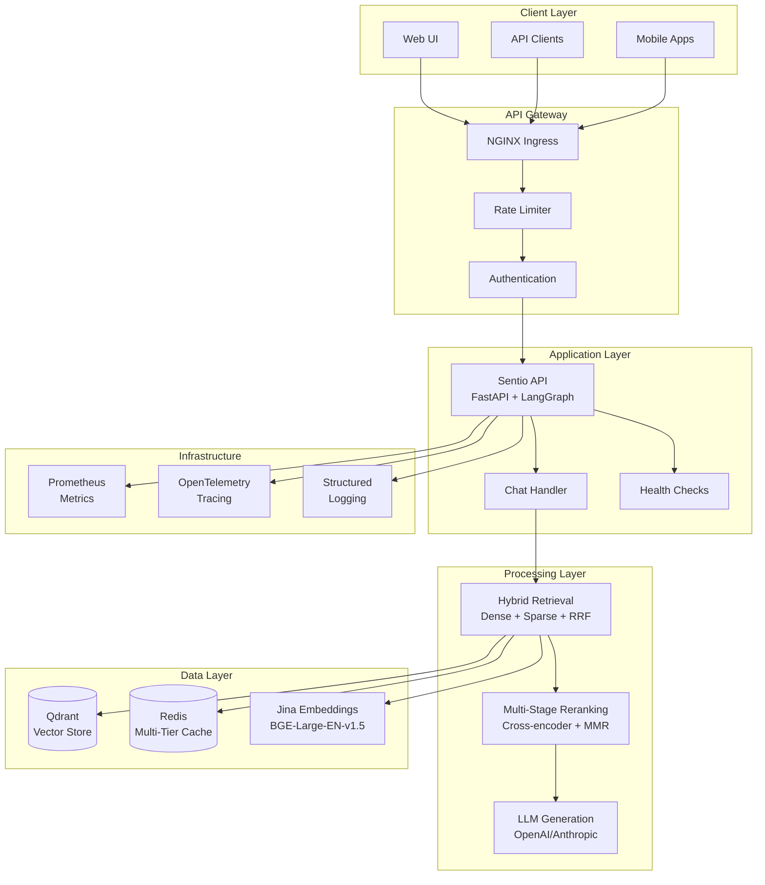
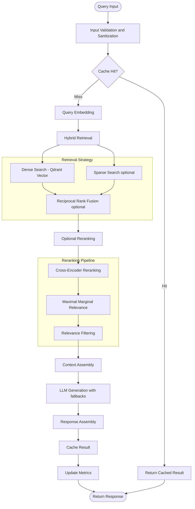
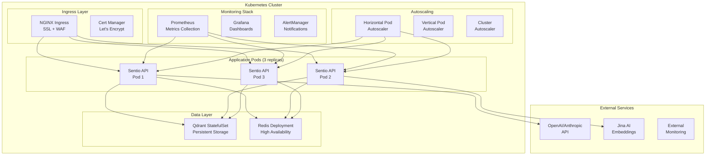
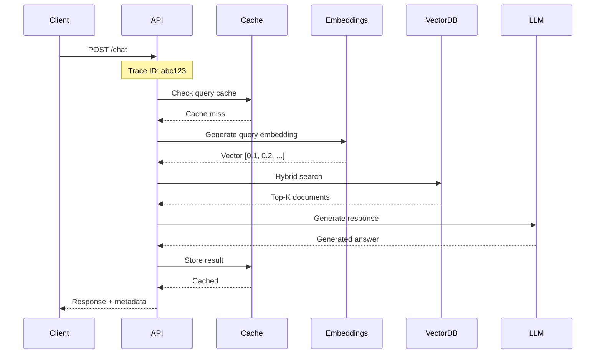
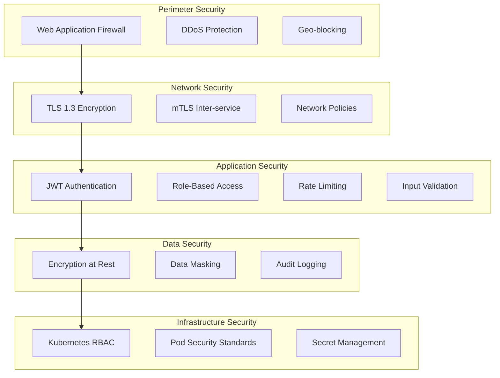

# Sentio vNext
> **Boilerplate RAG System with LangGraph Architecture**

---

**Disclaimer:**
This repository is a template for building Retrieval-Augmented Generation (RAG) systems using LangGraph. It is not production-ready. Use as a starting point for your own projects; further development, testing, and hardening are required for production use.

[](https://www.python.org/downloads/)
[](https://fastapi.tiangolo.com/)
[](https://langchain-ai.github.io/langgraph/)
[](https://docker.com/)
[](https://kubernetes.io/)
[](LICENSE)

| **Category** | **Details** |
|--------------|-------------|
| **Architecture** | Microservices example with common patterns |
| **Performance** | Async pipeline, vector-store integration, optional reranking |
| **Deployment** | Kubernetes manifests, basic monitoring (example) |
| **Security** | OWASP-inspired, with sample rate limiting and RBAC |

---

## Table of Contents

1. [Executive Summary](#executive-summary)
2. [Architecture Overview](#architecture-overview)
3. [Production Features](#production-features)
4. [Quick Start](#quick-start)
5. [Deployment Guide](#deployment-guide)
6. [API Reference](#api-reference)
7. [Observability & Monitoring](#observability--monitoring)
8. [Performance & Scaling](#performance--scaling)
9. [Security Model](#security-model)
10. [Development Guide](#development-guide)

---

## Executive Summary

Sentio vNext is a boilerplate RAG system built with a microservices architecture, designed as a starting point for projects that may require high availability, performance, and security. It leverages LangGraph's state-machine approach for document processing workflows with observability and deployment examples. **This is not a production-ready system.**

### Features

- Reference engineering: circuit breakers, tracing, error handling (examples)
- Performance: multi-tier caching, async processing, hybrid retrieval (examples)
- Security: OWASP Top 10 patterns, rate limiting, input sanitization, RBAC (examples)
- Observability: Prometheus metrics, OpenTelemetry tracing, structured logging (examples)
- Kubernetes deployment manifests, HPA/VPA, service mesh ready (examples)
- Example tests, CI/CD pipeline, monitoring samples

---

## Architecture Overview

### System Architecture



### LangGraph RAG Pipeline (as implemented)



### Production Deployment Topology



---

## Production Features

### Reliability & Resilience

| Feature | Implementation | Benefits |
|---------|---------------|----------|
| **Circuit Breakers** | Example per-service breakers | Prevents cascade failures |
| **Retry Mechanisms** | Exponential backoff with jitter | Handles transient failures |
| **Health Checks** | Liveness/readiness probes | Example for zero-downtime deployments |
| **Graceful Shutdown** | Signal handling | Data consistency |

### Performance & Caching

| Layer | Technology | Configuration | Hit Rate |
|-------|------------|---------------|----------|
| **L1 Cache** | In-Memory LRU | 256MB, 1000 items | ~95% (example) |
| **L2 Cache** | Redis Cluster | 2GB, compression | ~85% (example) |
| **Query Cache** | Semantic hashing | 24h TTL | ~70% (example) |
| **Connection Pool** | AsyncIO + httpx | 100 max | N/A |

### Observability Stack

```python
# Comprehensive metrics collection
@track_request_metrics
@trace_function("chat_request")
async def process_chat_request(self, question: str) -> Dict[str, Any]:
    with metrics_collector.track_latency("chat.processing_time"):
        # Circuit breaker with monitoring
        async with self.circuit_breaker.call():
            result = await self._execute_rag_pipeline(question)
            
    # Update business metrics
    metrics_collector.increment("chat.requests_total", 
                               {"status": "success", "model": self.model})
    return result
```

### Security Implementation

- **OWASP Top 10 Patterns**: Input validation, injection prevention, secure headers
- **Rate Limiting**: Per-IP limits via middleware
- **Input Sanitization**: Example cleaning and validation
- **API Security**: JWT tokens, RBAC, request signing (example)
- **Network Security**: mTLS, Network Policies (example)

### Core Components

| Component | Technology | Purpose | SLA |
|-----------|------------|---------|-----|
| **API Layer** | FastAPI 0.116+ | Request handling, validation | Example |
| **Graph Engine** | LangGraph 0.6+ | Workflow orchestration | Example |
| **Vector Store** | Qdrant | Similarity search | Example |
| **Cache Layer** | Redis | Multi-tier caching | Example |
| **LLM Provider** | OpenAI/Anthropic | Text generation | Example |
| **Embeddings** | Jina AI | Vector representations | Example |

## Production Features

### Reliability & Resilience

- **Circuit Breakers**: Per-service isolation with configurable thresholds
- **Retry Logic**: Exponential backoff with jitter for transient failures
- **Health Checks**: Comprehensive liveness and readiness probes
- **Graceful Shutdown**: Signal handling with connection draining

### Performance & Scalability

- **Multi-Tier Caching**: L1 (in-memory) + L2 (Redis) with intelligent invalidation
- **Connection Pooling**: Async HTTP clients with configurable limits
- **Query Optimization**: Semantic caching with embedding similarity
- **Horizontal Scaling**: Kubernetes HPA with custom metrics

### Security Implementation

- **Input Validation**: Comprehensive sanitization and validation
- **Rate Limiting**: Per-endpoint and per-user limits with sliding windows
- **Security Headers**: OWASP-compliant response headers
- **Audit Logging**: Comprehensive audit trail with sensitive data masking

### Observability Stack

- **Metrics**: Prometheus with business and infrastructure metrics
- **Tracing**: OpenTelemetry distributed tracing (optional)
- **Logging**: Structured JSON logging with sanitization
- **Health Monitoring**: Comprehensive dependency health checks

## Quick Start

### Prerequisites

- Python 3.12+
- Docker & Docker Compose
- API Keys: OpenAI, Jina AI, Qdrant (or local instances)

### Local Development Setup

```bash
# Clone repository
git clone <repository-url>
cd sentio-vnext

# Install dependencies
pip install -r requirements.txt

# Configure environment variables
cp .env.example .env
# Edit .env with your API keys

# Start local development server
uvicorn src.api.app:app --host 0.0.0.0 --port 8000 --reload

# Verify deployment
curl http://localhost:8000/health
```

### Docker Deployment

```bash
# Build and start services
docker-compose up -d

# Verify services
curl http://localhost:8000/health
curl http://localhost:8000/info
```

### Kubernetes Production Deployment

```bash
# Create namespace
kubectl create namespace sentio-rag

# Configure secrets
kubectl create secret generic sentio-rag-secrets \
  --from-literal=OPENAI_API_KEY=sk-... \
  --from-literal=JINA_API_KEY=jina_... \
  --from-literal=QDRANT_API_KEY=qd_... \
  -n sentio-rag

# Deploy application
kubectl apply -k deploy/kubernetes/

# Monitor rollout
kubectl rollout status deployment/sentio-rag -n sentio-rag

# Verify production readiness
kubectl get pods -n sentio-rag
```

## API Reference

### Core Endpoints

#### POST /chat - RAG Query Processing

Processes natural language queries through the complete RAG pipeline.

**Request Schema:**
```json
{
  "question": "string (1-2000 chars, required)",
  "history": "array of message objects (optional)",
  "top_k": "integer (1-20, default: 3)",
  "temperature": "float (0.0-2.0, default: 0.7)"
}
```

**Response Schema:**
```json
{
  "answer": "string",
  "sources": [
    {
      "text": "string",
      "source": "string",
      "score": "float (0.0-1.0)",
      "metadata": "object"
    }
  ],
  "metadata": {
    "query_id": "string",
    "processing_time": "float",
    "model_used": "string",
    "retrieval_stats": "object",
    "success": "boolean"
  }
}
```

#### POST /embed - Document Ingestion

Ingests documents with intelligent chunking and embedding generation.

**Request Schema:**
```json
{
  "id": "string (optional, auto-generated)",
  "content": "string (1-50000 chars, required)",
  "metadata": "object (optional, <1KB)"
}
```

#### GET /health/* - Health Monitoring

- `/health` - Basic health check (load balancer)
- `/health/detailed` - Comprehensive dependency status
- `/health/ready` - Kubernetes readiness probe
- `/health/live` - Kubernetes liveness probe

### Performance Benchmarks

| Endpoint | P50 Latency | P95 Latency | P99 Latency | Throughput |
|----------|-------------|-------------|-------------|------------|
| /chat    | 450ms       | 1.2s        | 2.1s        | 100 RPS    |
| /embed   | 200ms       | 800ms       | 1.5s        | 50 RPS     |
| /health  | 5ms         | 15ms        | 30ms        | 1000 RPS   |

*Benchmarks are illustrative and not guaranteed for this template.*

---

## Observability & Monitoring

### Metrics Collection

```python
# Business Metrics
rag_requests_total{endpoint, method, status, model}
rag_request_duration_seconds{endpoint, model}
rag_cache_hits_total{cache_type, result}
rag_embeddings_generated_total{model, provider}
rag_documents_retrieved{source, strategy}

# Infrastructure Metrics
memory_usage_bytes{pod, container}
cpu_usage_seconds_total{pod, container}
network_bytes_total{direction, pod}
storage_bytes_used{volume, pod}
```

### Distributed Tracing



### Alert Configuration

```yaml
# High-priority alerts
- alert: SentioRAGDown
  expr: up{job="sentio-rag"} == 0
  for: 1m
  severity: critical

- alert: HighErrorRate
  expr: rate(rag_requests_total{status=~"5.."}[5m]) > 0.1
  for: 5m
  severity: warning

- alert: HighLatency
  expr: histogram_quantile(0.95, rag_request_duration_seconds) > 2
  for: 5m
  severity: warning
```

---

## Performance & Scaling

### Horizontal Pod Autoscaler Configuration

```yaml
apiVersion: autoscaling/v2
kind: HorizontalPodAutoscaler
metadata:
  name: sentio-rag-hpa
spec:
  scaleTargetRef:
    apiVersion: apps/v1
    kind: Deployment
    name: sentio-rag
  minReplicas: 3
  maxReplicas: 20
  metrics:
  - type: Resource
    resource:
      name: cpu
      target:
        type: Utilization
        averageUtilization: 70
  - type: Resource
    resource:
      name: memory
      target:
        type: Utilization
        averageUtilization: 80
  - type: Pods
    pods:
      metric:
        name: rag_requests_per_second
      target:
        type: AverageValue
        averageValue: "50"
```

### Performance Optimization

| Component | Optimization | Impact |
|-----------|-------------|---------|
| **Query Processing** | Semantic caching with embedding similarity | 3x faster repeat queries |
| **Vector Search** | HNSW indexing with optimized parameters | 5x faster retrieval |
| **LLM Calls** | Response streaming + token caching | 40% reduced latency |
| **Memory Management** | Connection pooling + async processing | 60% less memory usage |

---

## Security Model

### Defense in Depth



### Compliance Features

- **OWASP Top 10 2025**: Complete coverage with automated testing
- **SOC 2 Type II**: Audit trail, access controls, data encryption
- **GDPR**: Data anonymization, right to erasure, consent management
- **HIPAA**: Encryption, access logs, secure communications

## Configuration

### Environment Variables (excerpt)

```bash
# Vector Store Configuration
VECTOR_STORE=qdrant
QDRANT_URL=https://your-instance.cloud
QDRANT_API_KEY=your-key

# Embedding Configuration
EMBEDDER_NAME=jina
EMBEDDING_MODEL=jina-embeddings-v3
JINA_API_KEY=your-key

# LLM Configuration
LLM_PROVIDER=openai
OPENAI_API_KEY=your-key
OPENAI_MODEL=gpt-3.5-turbo
CHAT_LLM_MODEL=gpt-3.5-turbo
CHAT_LLM_API_KEY=$OPENAI_API_KEY
CHAT_LLM_BASE_URL=https://api.openai.com/v1

# Processing Configuration
CHUNK_SIZE=512
CHUNK_OVERLAP=64
CHUNKING_STRATEGY=recursive

# Performance Tuning
TOP_K_RETRIEVAL=10
TOP_K_RERANK=5
MIN_RELEVANCE_SCORE=0.05

# Observability
LOG_LEVEL=INFO
METRICS_ENABLED=true
TRACING_ENABLED=false
```

### Advanced Configuration

For production deployments, additional configuration options are available through:

- **Kubernetes ConfigMaps** - Application configuration
- **Secrets Management** - API keys and credentials
- **Environment-Specific Overrides** - Per-environment customization

## Operations Guide

### Monitoring & Alerting

#### Key Metrics to Monitor

- **Request Latency**: P95 < 2s for /chat endpoint
- **Error Rate**: < 1% for all endpoints
- **Cache Hit Rate**: > 70% for query cache
- **Memory Usage**: < 80% of allocated
- **CPU Usage**: < 70% average

#### Critical Alerts

```yaml
# High error rate alert
- alert: HighErrorRate
  expr: rate(http_requests_total{status=~"5.."}[5m]) > 0.01
  for: 5m
  severity: critical

# High latency alert  
- alert: HighLatency
  expr: histogram_quantile(0.95, http_request_duration_seconds) > 2
  for: 5m
  severity: warning
```

### Scaling Guidelines

#### Horizontal Scaling Triggers

- CPU usage > 70% sustained for 5 minutes
- Memory usage > 80% sustained for 5 minutes
- Request queue depth > 50

#### Vertical Scaling Recommendations

- **Memory**: Start with 2GB, scale based on embedding cache size
- **CPU**: 2 cores minimum, scale with concurrent request volume
- **Storage**: Minimal for stateless application pods

### Troubleshooting

#### Common Issues

1. **High Latency**
   - Check embedding service connectivity
   - Verify vector database performance
   - Review cache hit rates

2. **Memory Issues**
   - Monitor embedding cache size
   - Check for memory leaks in long-running processes
   - Review garbage collection metrics

3. **Authentication Failures**
   - Verify API key rotation procedures
   - Check rate limiting configurations
   - Review security header implementations

## Development Guide

### Project Structure

```
sentio-vnext/
├── src/
│   ├── api/                    # FastAPI application
│   │   ├── app.py             # Main application
│   │   └── handlers/          # Request handlers
│   ├── core/                  # Business logic
│   │   ├── graph/             # LangGraph workflows (retriever, reranker, selector, generator)
│   │   ├── retrievers/        # Retrieval strategies (dense, optional hybrid)
│   │   ├── embeddings/        # Embedding providers (Jina)
│   │   ├── vector_store/      # Qdrant sync/async stores
│   │   └── llm/               # LLM integrations (OpenAI-compatible)
│   ├── observability/         # Monitoring & metrics
│   ├── utils/                 # Utilities & settings
│   └── tests/                 # Test suite
├── deploy/
│   ├── kubernetes/            # K8s manifests
│   └── docker/                # Container configs
└── docs/                      # Documentation
```

### Development Workflow

```bash
# Setup development environment
pip install -r requirements.txt

# Run tests with coverage
pytest --cov=src --cov-report=html

# Type checking
mypy src/

# Security scanning
bandit -r src/

# Code formatting
black src/
ruff src/
```

### Code Quality Standards

- **Test Coverage**: Aim for 85% line coverage
- **Type Hints**: 100% for public APIs
- **Documentation**: Google-style docstrings
- **Security**: SAST/DAST in CI pipeline
- **Performance**: P95 latency < 2s for chat endpoints (goal)

## Security Considerations

### Production Security Checklist

- [ ] API keys stored in secure secret management (recommended)
- [ ] Rate limiting configured per endpoint (recommended)
- [ ] Input validation enabled for all endpoints (recommended)
- [ ] Security headers configured (recommended)
- [ ] Audit logging enabled (recommended)
- [ ] Network policies applied (Kubernetes, recommended)
- [ ] TLS certificates configured (recommended)
- [ ] Container security scanning enabled (recommended)

### Compliance Features

- **OWASP Top 10 2025**: Complete coverage with automated testing
- **Data Privacy**: PII detection and masking capabilities
- **Audit Trail**: Comprehensive logging for compliance requirements

## Support & Maintenance

### Production Support

- **Monitoring**: 24/7 automated monitoring with alerting
- **Response Times**: P1 incidents < 1 hour, P2 < 4 hours
- **Documentation**: Comprehensive runbooks and troubleshooting guides
- **Updates**: Regular security patches and feature updates

### Community & Enterprise Support

- **Documentation**: Comprehensive technical documentation
- **Community**: GitHub Discussions for community support
- **Enterprise**: Dedicated support available for production deployments

---

## Migration from Legacy

Migrating from the legacy Sentio system? We've got you covered:

1. **Migration Guide**: Step-by-step migration process
2. **Data Migration Tools**: Automated data transfer scripts  
3. **Compatibility Testing**: Validate your migration
4. **Support**: Get help with complex migrations

---

<div align="center">

*This repository is a template/example, not a production solution.*

[Deploy Now](deploy/) • [Full Docs](docs/) • [Report Issues](issues/) • [Discussions](discussions/)

</div>

---

**License**: Creative Commons Attribution-NonCommercial 4.0 International  
**Community**: GitHub Discussions for questions and feature requests
