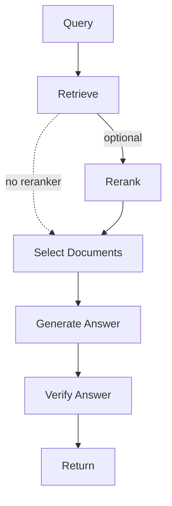

# Sentio LangGraph RAG (Boilerplate)

Boilerplate/template RAG using LangGraph, trimmed to essentials. Not production‑ready; expect to harden before real use.

## What it does
- RAG pipeline in LangGraph: retrieve → optional rerank → select → generate → verify.
- Retrieval: Dense (Qdrant + embeddings) + optional sparse BM25 with fusion (rrf/weighted_rrf/comb_sum).
- Generation: prompt‑driven, numbered context, bracket citations [n].
- Verification: LLM self‑check audits answer vs context; can revise failed answers.

## Pipeline

Retrieval details
- Dense: Qdrant store queried with embeddings (Jina provider by default).
- Sparse: in‑memory BM25 (or Pyserini if configured).
- Fusion: rrf (default) | weighted_rrf | comb_sum (min–max normalized). Weights via env.
- Scorers: semantic similarity, keywords, MMR supported as plugins.

## Prompts
- All prompts live in `prompts/` and are loaded at runtime:
  - `profile.md` (system), `retrieve.md` (QA), `summarize.md`, `verify.md` (answer audit)
- Prompts enforce citation with [n] and state insufficiency when context is lacking.

## Verification
- `AnswerVerifier` builds a strict JSON audit (verdict pass|warn|fail, notes, citations_ok, revised_answer?) and annotates pipeline metadata.
- On `fail` with `revised_answer`, the answer is replaced.
- Toggle with `USE_VERIFIER=true|false` (default true).

## Quick start
- Requirements: Python 3.12, a running Qdrant (or change env to your endpoint), API keys for LLM and embeddings.
- Install: `pip install -r requirements.txt`; copy `.env.example` → `.env` and fill keys.
- Run API: `uvicorn src.api.app:app --reload`
- Test chat: `POST /chat` with `{ "question": "..." }`.

## Key env vars
- Vector store: `QDRANT_URL`, `QDRANT_API_KEY`, `COLLECTION_NAME`.
- Embeddings: `EMBEDDER_NAME=jina`, `EMBEDDING_MODEL=jina-embeddings-v3`, `EMBEDDING_MODEL_API_KEY`.
- LLM: `LLM_PROVIDER=openai`, `CHAT_LLM_BASE_URL`, `CHAT_LLM_API_KEY`, `CHAT_LLM_MODEL`.
- Retrieval: `RETRIEVAL_STRATEGY=dense|bm25|pyserini|hybrid`, `RETRIEVAL_TOP_K`, `RRF_K`.
- Fusion: `FUSION_METHOD=rrf|weighted_rrf|comb_sum`, `DENSE_WEIGHT`, `SPARSE_WEIGHT`.
- Reranker (optional): `USE_RERANKER=true|false`, `RERANKER_MODEL`, `RERANKER_URL`.
- Verification: `USE_VERIFIER=true|false`.
- OpenRouter headers (if used): `OPENROUTER_REFERER`, `OPENROUTER_TITLE`.

## API surface (trimmed)
- `POST /chat` → `{ answer, sources[], metadata }`
  - Metadata includes `verify_verdict`, `verify_citations_ok`, `verify_notes` when verifier is on.
- `POST /embed` → embeds a document into the vector store.
- `/health/*` → liveness/readiness + dependency snapshot.

## What’s deliberately not over‑sold
- Cross‑encoder reranking is not implemented; reranking uses Jina API (optional) and falls back gracefully.
- Caching is present but minimal by default; tune per environment.
- Guardrails/policy enforcement not included; add per domain needs.
- This is a reference; expect to audit security, performance, and infra before production.

## Where to look in code
- Retrieval: `src/core/retrievers/*` (hybrid fusion, BM25, dense)
- Reranker: `src/core/rerankers/jina_reranker.py` (API‑based)
- Graph: `src/core/graph/factory.py`, `src/core/graph/nodes.py`
- LLM: `src/core/llm/*` (generator, prompts, verifier)
- Prompts: `prompts/` (edit without code changes)

## License
See `LICENSE`. Use at your own risk; no guarantees.
