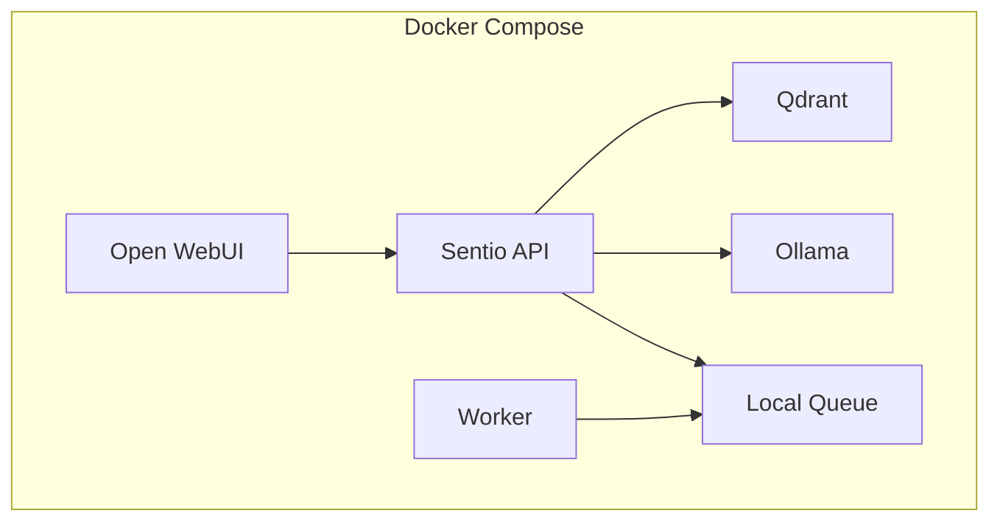
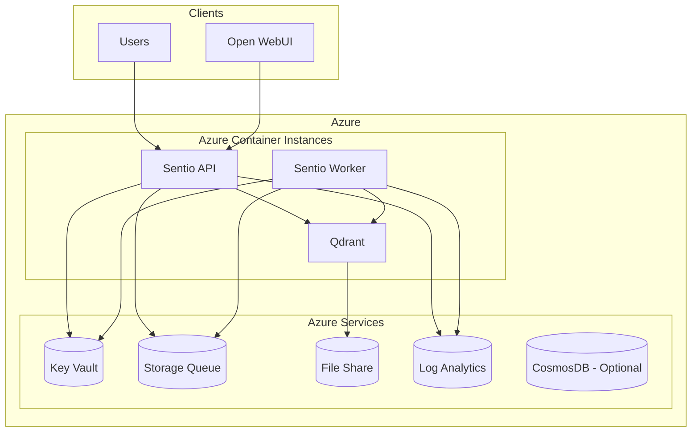

# Sentio RAG System

Sentio is a production-grade Retrieval-Augmented Generation (RAG) platform for enterprise document processing and intelligent question answering.

---

## 1. Key Features

*   **Hybrid Retrieval**: Combines dense and reranked search for high relevance.
*   **Streaming Responses**: Real-time answer generation.
*   **Pluggable LLM Backend**: Supports Ollama (default) and OpenRouter.
*   **Azure-Native Deployment**: Optimized for Azure Container Instances (ACI).
*   **Observability**: Integrated with Prometheus metrics and Azure Log Analytics.

---

## 2. Architecture

### 2.1 Core Components

| Layer         | Technology                             | Purpose                                  |
|---------------|----------------------------------------|------------------------------------------|
| **API**       | FastAPI + Uvicorn                      | REST / OpenAPI interface                 |
| **Vector DB** | Qdrant                                 | High-performance similarity search       |
| **Embeddings**| Jina AI v4                             | Text embedding generation                |
| **Reranker**  | Jina AI v2                             | Semantic result reranking                |
| **LLM**       | OpenRouter (default, cloud) / Ollama (local optional) | Answer generation |
| **Async Tasks**| Azure Storage Queue                  | Task queue (document ingestion)   |
| **Worker** | Sentio Worker container | Executes background jobs from queue |
| **Metadata**  | CosmosDB (optional)                    | Chat history and document metadata       |

### 2.2 Local Development Topology


```mermaid
graph TD
    subgraph DockerCompose ["Docker Compose"]
        API[Sentio API]
        QD[Qdrant]
        OL[Ollama]
        WRK[Worker]
        QUEUE[Local Queue]
        WEB[Open WebUI]
    end

    API --> QD
    API --> OL
    API --> QUEUE
    WRK --> QUEUE
    WEB --> API
```

### 2.3 Azure Production Topology (Primary)


```mermaid
graph TD
    subgraph Clients
        U[Users]
        W[Open WebUI]
    end

    subgraph Azure
        subgraph ACI ["Azure Container Instances"]
            API[Sentio API]
            Worker[Sentio Worker]
            Qdrant[Qdrant]
        end

        subgraph Services ["Azure Services"]
            KV[(Key Vault)]
            Queue[(Storage Queue)]
            FS[(File Share)]
            LOG[(Log Analytics)]
            CDB[(CosmosDB - Optional)]
        end

        U --> API
        W --> API

        API --> Queue
        API --> Qdrant
        API --> KV
        API --> LOG

        Worker --> Queue
        Worker --> Qdrant
        Worker --> KV
        Worker --> LOG

        Qdrant --> FS
    end
```
*   **Primary Deployment Target**: **Azure Container Instances (ACI)** for a balance of cost and performance.
*   **Alternative**: Azure Container Apps can be used for scenarios requiring auto-scaling and managed revisions. Templates are available in `infra/azure/`.

---

## 3. Quick Start

### 3.1 Local Development

**Prerequisites**: Docker, **OpenRouter API Key**, (optional) Ollama, Jina AI Key.

1.  **Install Ollama** (for local LLM acceleration):
    For macOS with M1/M2/M3:
    ```bash
    brew install ollama
    ollama serve &
    ollama pull phi3.5:3.8b
    ```
    For other platforms, see the [Ollama.ai](https://ollama.ai) guide.

2.  **Configure Environment**:
    ```bash
    cp root/.env.example root/.env
    echo "JINA_API_KEY=your-jina-api-key" >> root/.env
    ```

3.  **Launch Stack**:
    ```bash
    # Start API, Qdrant, and WebUI
    docker compose up -d

    # Optional: Ingest documents
    docker compose --profile tools up ingest
    ```

4.  **Access System**:
    *   **Web UI**: `http://localhost:3000`
    *   **API Docs**: `http://localhost:8000/docs`

### 3.2 Azure ACI (Production)

**Prerequisites**: Azure CLI, Docker.

1.  **Deploy Infrastructure**:
    ```bash
    cd infra/azure
    ./deploy-infra.sh
    ```
    *Creates Resource Group, Key Vault, Storage (Queue, File Share), Log Analytics, and CosmosDB.*

2.  **Deploy Qdrant**:
    ```bash
    ./deploy-qdrant.sh
    ```
    *Deploys Qdrant to an ACI, backed by an Azure File Share.*

3.  **Configure Secrets**:
    ```bash
    ./setup-secrets.sh
    ```
    *Stores API keys (Jina, OpenRouter) and connection strings in Key Vault.*

4.  **Deploy Applications**:
    ```bash
    ./deploy-container-apps.sh
    ```
    *Deploys the API and Worker containers to ACI.*

After deployment, use the FQDN provided by the script (e.g., `http://sentio-api-free.westeurope.azurecontainer.io:8000`). For a detailed guide, see [`infra/azure/DEPLOYMENT.md`](./infra/azure/DEPLOYMENT.md).

---

## 4. Configuration

### 4.1 Base Environment Variables

| Variable           | Default                | Required | Notes                        |
|--------------------|------------------------|----------|------------------------------|
| `JINA_API_KEY`     | —                      | ✔️       | Get a free key from Jina AI.   |
| `QDRANT_URL`       | `http://qdrant:6333`   | ✖️       | Overridden in Azure deployment.|
| `OLLAMA_URL`       | `http://ollama:11434`  | ✖️       | For local development.       |
| `OLLAMA_MODEL`     | `phi3.5:3.8b`          | ✖️       | Default local model.         |
| `OPENROUTER_URL`   | —                      | ✖️       | Optional alternative LLM backend.|
| `OPENROUTER_MODEL` | —                      | ✖️       | Specify if using OpenRouter. |
| `OPENROUTER_API_KEY` | — | ✖️ (required if using OpenRouter) | Needed for cloud LLM (default in Azure) |

### 4.2 Azure-specific Variables (Managed via Scripts & Key Vault)

| Variable                        | Example Value                         | Purpose                           |
|---------------------------------|---------------------------------------|-----------------------------------|
| `USE_AZURE`                     | `true`                                | Enables Azure-specific logic.     |
| `AZURE_QUEUE_NAME`              | `submissions`                         | Queue for asynchronous jobs.      |
| `AZURE_QUEUE_CONNECTION_STRING` | *secret*                              | Grants access to the queue.       |
| `COSMOS_ACCOUNT_NAME` / `KEY`   | `cosmos-sentio` / *secret*            | Optional metadata storage.        |
| `COLLECTION_NAME`               | `Sentio_docs_v2`                      | The name of the Qdrant collection.|

---

## 5. Retrieval Parameters (Defaults)

*   **Initial Retrieval**: **10** documents
*   **Post-Rerank Results**: **3** documents
*   **Vector Size**: **1024** (Jina v4)
*   **Distance Metric**: **Cosine**

---

## 6. API Reference (Excerpt)

| Method | Path    | Description      |
|--------|---------|------------------|
| `GET`  | `/health`| Service health check.|
| `POST` | `/chat` | Main RAG query endpoint.|

`POST /chat` Request Body:
```json
{
  "question": "What is the company policy on remote work?",
  "history": []
}
```

---

## 7. Troubleshooting

### 7.1 Local Environment
*   **API Connection**: Check logs with `docker compose logs api`. Ensure Ollama is running (`ps aux | grep ollama`) and the model is downloaded (`ollama list`).
*   **Relevance Issues**: Adjust `TOP_K_RERANK`, `SENTIO_MIN_SCORE` in `root/.env` and re-ingest if necessary (`docker compose --profile tools up ingest`).
*   **Debug Commands**:
    *   `python debug/stack_debug.py --pretty` (collection stats)
    *   `python debug/test_search.py "What's OSINT?" --pretty` (test query)
    *   `curl -s localhost:6333/collections/Sentio_docs_v2` (check Qdrant)

### 7.2 Azure Environment
*   **Embedding Errors**: Verify `JINA_API_KEY` in Key Vault and check API rate limits.
*   **Qdrant Connection**: Check container status with `az container logs` and confirm the URL in Key Vault.
*   **Authentication**: Ensure you are logged in (`az login`) to the correct Azure subscription.

---

## 8. License & Contributing

Sentio is released under the MIT License. Contributions are welcome—please include tests and adhere to standard code style. 
