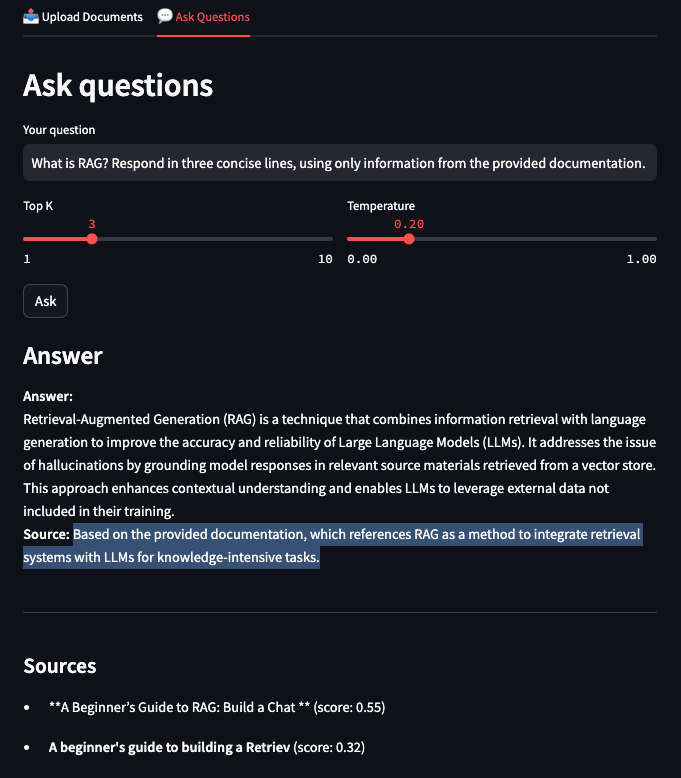
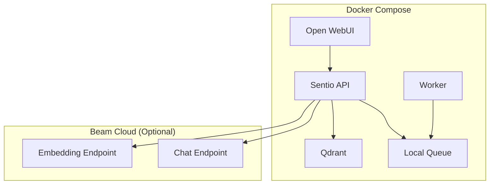
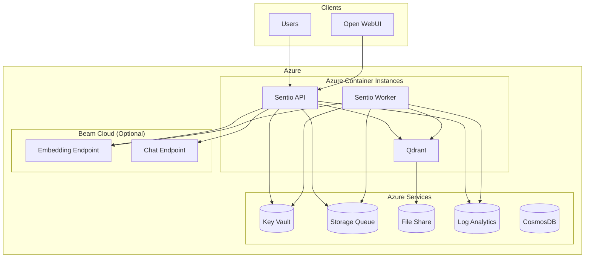
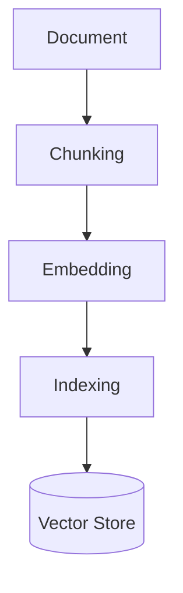
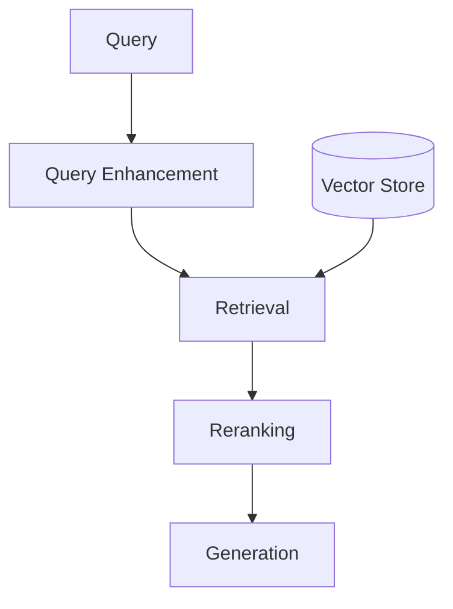

# Sentio RAG System

**Modular RAG Lab – Experimental Boilerplate for Enterprise-Grade RAG**

| **Category**      | **Details**                                                                 |
|-------------------|-----------------------------------------------------------------------------|
| **Core Features** | Modular architecture, pluggable components, hybrid retrieval, observability |
| **Deployment**    | Cloud-native with private infrastructure options, containerized, CI/CD ready |
| **Extensibility** | Plugin system, provider abstraction, configurable pipeline stages           |

## Version History

* **0.7.1** (Beta, Current): Modular RAG pipeline, hybrid retrieval, plugin architecture, Azure/Beam integration, improved observability. Not production-ready; for experimentation and prototyping.
* **0.6.0** (Alpha): Dense retrieval, basic reranking, initial plugin system
* **0.5.0** (Alpha): Minimal RAG pipeline, Qdrant integration

> **Current Status (v0.7.1 Beta):**
> * **Prototype**: Modular, extensible, and pluggable RAG pipeline for rapid experimentation
> * **Hybrid Retrieval**: Dense + BM25 with configurable fusion
> * **Flexible Deployment**: Cloud-native core, Beam/Azure integration (lab-ready)
> * **Plugin System**: Drop-in modules for retrievers, rerankers, embedding providers
> * **Observability**: Prometheus metrics, basic logging
> * **Not production-ready**: No full test coverage, limited documentation, evolving API

---




## 1. Key Features

* **Modular Architecture** – Clearly defined components with standardized interfaces for customization
* **Deployment Flexibility** – Cloud-native core with options for private infrastructure via Beam
* **Hybrid Retrieval** – Configurable combination of dense and sparse retrieval methods
* **Plugin System** – Extend functionality through the `plugins/` directory with auto-discovery
* **Azure/Beam Integration** – For experimentation with cloud and private deployments
* **Observability** – Prometheus metrics, basic logging, and monitoring hooks

---

## 2. Architecture

### 2.1 Core Components

| Layer           | Technology                             | Purpose                                  |
|-----------------|----------------------------------------|------------------------------------------|
| **API**         | FastAPI + Uvicorn                      | REST / OpenAPI interface                 |
| **Vector DB**   | Qdrant                                 | Dense vector & cache collections         |
| **Embeddings**  | Provider abstraction:<br>- Jina AI Cloud (default)<br>- Beam (private deployment)<br>- Local models via plugins | Semantic encoding |
| **Retrieval**   | Modular pipeline:<br>- Dense vectors<br>- BM25 sparse retrieval<br>- Fusion strategies | Document retrieval |
| **Reranker**    | Configurable cascade:<br>- Cross-encoder primary<br>- Optional secondary reranker | Result refinement |
| **LLM**         | Provider abstraction:<br>- OpenRouter API (default)<br>- Beam (private)<br>- Local models via plugins | Answer generation |
| **Async Tasks** | Azure Storage Queue / Local Queue       | Background processing                    |
| **Worker**      | Sentio Worker container                 | Executes background jobs from queue      |
| **Metadata**    | CosmosDB (production) / Local storage (development) | Chat history and document metadata |

### 2.2 Local Development Topology


```mermaid
graph TD
    subgraph DockerCompose ["Docker Compose"]
        API[Sentio API]
        QD[Qdrant]
        WRK[Worker]
        QUEUE[Local Queue]
        WEB[Open WebUI]
    end

    subgraph BeamCloud ["Beam Cloud (Optional)"]
        EMBED[Embedding Endpoint]
        CHAT[Chat Endpoint]
    end

    API --> QD
    API --> QUEUE
    API --> EMBED
    API --> CHAT
    WRK --> QUEUE
    WEB --> API
```

### 2.3 Azure Production Topology


```mermaid
graph TD
    subgraph Clients
        U[Users]
        W[Open WebUI]
    end

    subgraph Azure
        subgraph ACI ["Azure Container Instances"]
            API[Sentio API]
            Worker[Sentio Worker]
            Qdrant[Qdrant]
        end

        subgraph Services ["Azure Services"]
            KV[(Key Vault)]
            Queue[(Storage Queue)]
            FS[(File Share)]
            LOG[(Log Analytics)]
            CDB[(CosmosDB)]
        end

        subgraph BeamCloud ["Beam Cloud (Optional)"]
            EMBED[Embedding Endpoint]
            CHAT[Chat Endpoint]
        end

        U --> API
        W --> API

        API --> Queue
        API --> Qdrant
        API --> KV
        API --> LOG
        API --> EMBED
        API --> CHAT

        Worker --> Queue
        Worker --> Qdrant
        Worker --> KV
        Worker --> LOG
        Worker --> EMBED

        Qdrant --> FS
    end
```

---

## 3. Quick Start

**Prerequisites:** Docker, Docker Compose, and API keys from Jina AI and OpenRouter (or Beam API token if using private deployment).

1. **Configure Environment**

   First, copy the example environment file. This file lists all configurable variables for the project.

   ```bash
   cp .env.example .env
   ```

   Next, open the newly created `.env` file and set your API keys. At a minimum, you need to provide:
   * `EMBEDDING_MODEL_API_KEY`: For the default embedding provider (Jina AI).
   * `CHAT_LLM_API_KEY`: For the LLM generation provider (OpenRouter by default).

   **For Beam deployment (optional):**
   * `BEAM_API_TOKEN`: Your Beam API token for authentication.
   * `BEAM_EMBEDDING_BASE_CLOUD_URL`: URL to your deployed embedding endpoint.
   * `EMBEDDING_PROVIDER=beam`: Set to use Beam as your embedding provider.
   * `CHAT_PROVIDER=beam`: Optionally set to use Beam for chat (requires chat model deployment).

2. **Launch Stack & Ingest Data**

   Run the following command to build and start all services:

   ```bash
   docker compose up -d --build
   ```

   You can monitor the logs to see the progress of all services:

   ```bash
   docker compose logs -f
   ```

3. **Access System**

   Once the services are running, you can access:
   * **Web UI**: `http://localhost:8501`
   * **API Docs**: `http://localhost:8000/docs`

4. **(Optional) Ingest Custom Data**

   To ingest your own documents:

   ```bash
   ./run.sh ingest path/to/your/docs
   ```

5. **(Optional) Deploy Beam Endpoints**

   To deploy your own embedding model on Beam Cloud:

   ```bash
   beam deploy root/src/integrations/beam/app.py:embed_endpoint
   ```

   For GPU acceleration, the default configuration uses T4 GPU. You can customize resources:

   ```bash
   beam deploy root/src/integrations/beam/app.py:embed_endpoint --cpu 2 --memory 8Gi --gpu T4
   ```

   Similarly, for chat model deployment:

   ```bash
   beam deploy root/src/integrations/beam/app.py:chat_endpoint --cpu 4 --memory 16Gi --gpu A10G
   ```


## CI/CD Process

### Automated Docker Image Build

This project uses GitHub Actions for automated Docker image build and publishing on every push to the `main` branch. Images are stored in GitHub Container Registry (ghcr.io).

#### Main CI/CD Components:

1. **Image Build**:
   - Optimized multi-stage build to reduce image size
   - Parallel build of three images: API, Worker, and UI
   - Multi-platform support (linux/amd64, linux/arm64)
   - Layer caching for faster builds

2. **Tagging**:
   - latest
   - version from pyproject.toml
   - commit SHA
   - version-date (format: 0.1.0-20230315)

3. **Azure Deployment**:
   - After image build, you can deploy to Azure Container Apps
   - `./infra/azure/scripts/deploy-apps.sh`

### Local Build

To build images locally, use:

```bash
./infra/azure/scripts/build-multi-arch.sh
```

### Docker Image Structure

1. **API (`sentio-api`)**:
   - FastAPI application for request processing
   - Endpoints for search and chat
   - Qdrant request handling

2. **Worker (`sentio-worker`)**:
   - Background task processing
   - Azure queue message handling
   - Document indexing

3. **UI (`sentio-ui`)**:
   - Streamlit interface for API interaction
   - Web interface for search and chat

## Running with docker-compose

```bash
docker-compose up -d
```

## Environment Variables

Main environment variables are defined in `.env`. See `.env.example` for a sample configuration.

## Deployment Testing

After deployment, you can run basic smoke tests:

```bash
./tests/smoke.sh <api_url>
```


---

## 4. API Reference

### Main Endpoints

| Method | Path                  | Description                                 |
|--------|-----------------------|---------------------------------------------|
| GET    | /health               | Service health check                        |
| GET    | /info                 | Runtime configuration & build info          |
| POST   | /chat                 | Main RAG query endpoint (sync JSON)         |
| POST   | /chat/stream          | Main RAG query endpoint (streaming SSE)     |
| POST   | /embed                | Ingest a raw text document                  |
| POST   | /search               | Vector similarity search                    |
| POST   | /v1/chat/completions  | OpenAI-compatible endpoint for UI integration |

### Payloads

#### `/chat` & `/chat/stream`

* **Request**: `{ "question": "Your question here", "top_k": 5 }`
* **Response** (`/chat`): `{ "answer": "...", "sources": [...] }`
* **Response** (`/chat/stream`): Server-Sent Events (SSE) stream of answer tokens.

#### `/embed`

* **Request**: `{ "content": "Text content to ingest." }`
* **Response**: `{ "status": "success", "queued": false, "id": "..." }`

#### `/search`

* **Request**: `{ "query": "Your search query", "limit": 10 }`
* **Response**: `{ "results": [ ... ] }`

---

## 5. RAG Pipeline Architecture

### 5.1 Document Processing Flow


```mermaid
graph TD
    DOC[Document] --> CHUNK[Chunking]
    CHUNK --> EMBED[Embedding]
    EMBED --> INDEX[Indexing]
    INDEX --> VSTORE[(Vector Store)]
```

1. **Document Ingestion**: Documents are processed through the `/embed` endpoint
2. **Chunking**: Text is split into semantic units with configurable size and overlap
3. **Embedding**: Chunks are encoded using the configured embedding provider
4. **Indexing**: Vectors are stored in Qdrant with metadata

### 5.2 Query Processing Flow


```mermaid
graph TD
    Q[Query] --> QE[Query Enhancement]
    QE --> RET[Retrieval]
    RET --> RERANK[Reranking]
    RERANK --> GEN[Generation]
    
    VSTORE[(Vector Store)] --> RET
```

1. **Query Processing**: User query is optionally enhanced (expansion, reformulation)
2. **Retrieval**: Hybrid retrieval combines dense and sparse search results
3. **Reranking**: Multi-stage reranking refines the retrieved documents
4. **Generation**: LLM generates the final answer based on retrieved context

---

## 6. Deployment Options

### 6.1 Cloud-Native Deployment

The default configuration uses cloud services for embedding and LLM generation:

* **Embedding**: Jina AI Cloud API
* **LLM**: OpenRouter API (with various model options)
* **Infrastructure**: Azure Container Instances

### 6.2 Private Infrastructure

For data privacy or cost optimization, deploy models on private infrastructure:

```bash
# Deploy embedding model
beam deploy root/src/integrations/beam/app.py:embed_endpoint --cpu 2 --memory 8Gi --gpu T4

# Deploy chat model
beam deploy root/src/integrations/beam/app.py:chat_endpoint --cpu 4 --memory 16Gi --gpu A10G
```

### 6.3 Resource Configurations

| Resource Profile | Configuration              | Use Case            | Approx. Cost/hr |
|------------------|---------------------------|---------------------|-----------------|
| **Standard**     | T4 GPU, 2 CPU, 8GB RAM    | General embedding   | ~$1.08/h        |
| **Performance**  | A10G GPU, 4 CPU, 16GB RAM | High-throughput     | ~$2.20/h        |
| **Economy**      | CPU only, 2 CPU, 4GB RAM  | Development/testing | ~$0.54/h        |

---

## 7. Extension & Plugin System

Sentio uses a plugin architecture for extensibility. Plugins are automatically discovered in the `plugins/` directory.

### 7.1 Available Plugin Types

* **Embedding Providers**: Add custom embedding models
* **Retrievers**: Implement specialized retrieval methods
* **Rerankers**: Add custom reranking logic
* **LLM Providers**: Integrate additional language models
* **Evaluators**: Add evaluation metrics and feedback loops

### 7.2 Creating a Custom Plugin

Plugins follow a standardized interface pattern. Example plugin structure:

```
plugins/
  my_plugin/
    __init__.py
    plugin.py
    config.py
    requirements.txt
```

See the developer documentation for detailed plugin development guides.

---

## 8. CLI Tools

Sentio includes a unified CLI for common maintenance and development tasks:

```bash
# Start the stack in development or production mode
./run.sh start [--mode dev|prod]

# Stop the stack
./run.sh stop

# Restart the stack
./run.sh restart [--mode dev|prod]

# Show stack status
./run.sh status

# View logs
./run.sh logs [service] [-n lines]

# Ingest documents
./run.sh ingest [path]

# Run tests
./run.sh test

# Run chat tests
./run.sh chat-test [-p preset] [-v]

# Check environment variables
./run.sh env
```

---

## 9. License & Contributing

Sentio is released under the Creative Commons Attribution-NonCommercial 4.0 International License (CC BY-NC 4.0). Commercial use without explicit permission is strictly prohibited. Contributions are welcome—please include tests and adhere to standard code style.
