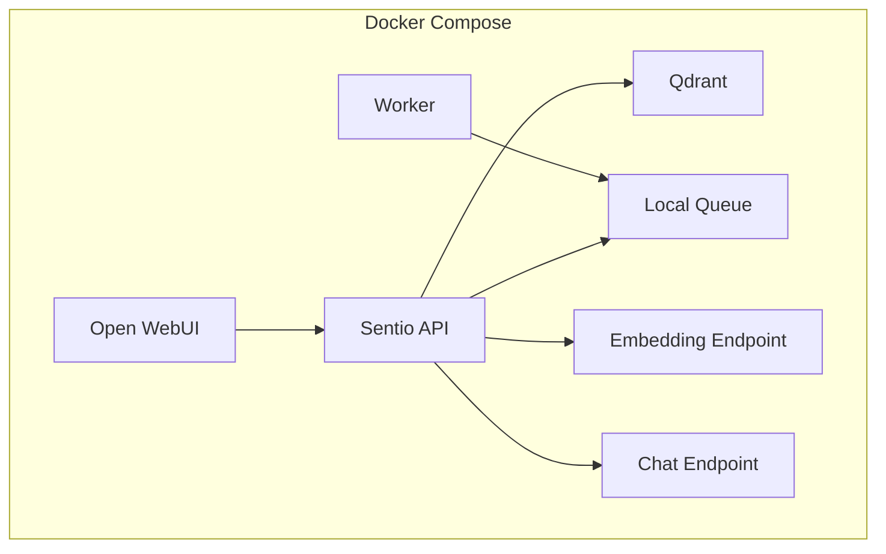
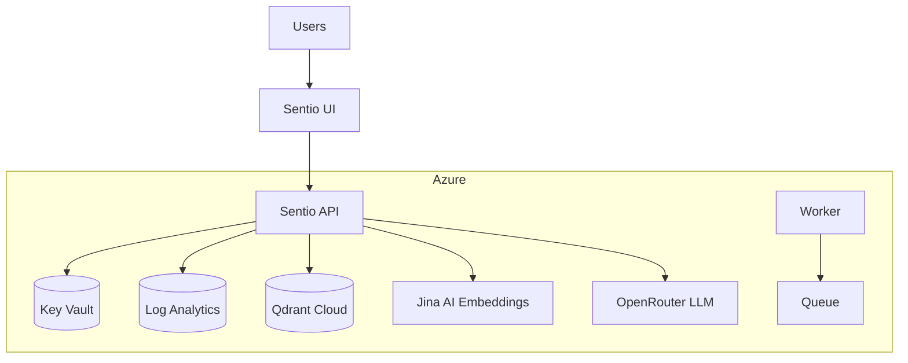

# Sentio RAG System  
**Note**: This foundational boilerplate accelerates RAG system development from scratch.  
For a modern version, see https://github.com/chernistry/sentio-vnext.  

**Modular foundation for enterprise-grade Retrieval-Augmented Generation (RAG) systems**  

| **Category**      | **Details**                                                                 |
|-------------------|------------------------------------------------------------------------------|
| **Core Features** | Modular architecture, pluggable components, hybrid retrieval, observability |
| **Deployment**    | Cloud-native with private infrastructure options, containerized, CI/CD ready |
| **Extensibility** | Plugin system, provider abstraction, configurable pipeline stages           |

## Version History
* **0.7.2** (Beta, Current): RAG evaluation endpoints, pipeline refactor (RRF-based hybrid 
  retrieval, Pyserini support), `/clear` maintenance endpoint, expanded CLI (flush, build, 
  index, locust), hot-swappable plugins, stronger config validation.
* **0.7.1** (Beta): Modular RAG pipeline, hybrid retrieval, plugin architecture, Azure/Beam 
  integration, improved observability.
* **0.6.0** (Alpha): Dense retrieval, basic reranking, initial plugin system  
* **0.5.0** (Alpha): Minimal RAG pipeline, Qdrant integration  

> **Current Status (v0.7.2 Beta):**  
> * **Prototype+**: Stabilizing core with improved fault tolerance  
> * **Hybrid Retrieval**: Dense + BM25 with RRF, optional Pyserini  
> * **Evaluation**: Built-in RAGAS metrics (`/evaluation/*`)  
> * **Maintenance**: Fast collection wipe via `/clear`, extended CLI helpers  
> * **Plugin System**: Hot-swap & env-driven auto-load  
> * **Observability**: Prometheus metrics, structured logging  
> * **Not production-ready**: Coverage improving, API subject to change  

---

## 1. Key Features
* **Modular Architecture** – Clearly defined components with standardized interfaces  
* **Deployment Flexibility** – Cloud-native core with Beam-based private options  
* **Hybrid Retrieval** – Configurable dense + sparse search with fusion strategies  
* **Plugin System** – Auto-discovery via `plugins/` directory  
* **Azure/Beam Integration** – Optional cloud/private deployments  
* **Observability** – Prometheus metrics, structured logging, monitoring hooks  

---

## 2. Architecture

### 2.1 Core Components
| Layer           | Technology                             | Purpose                                  |
|-----------------|----------------------------------------|------------------------------------------|
| **API**         | FastAPI + Uvicorn                      | REST / OpenAPI interface                 |
| **Vector DB**   | Qdrant                                 | Dense vector & cache collections         |
| **Embeddings**  | Jina AI / Beam / Local plugins         | Semantic encoding                        |
| **Retrieval**   | Dense vectors + BM25 + RRF             | Document retrieval                       |
| **Reranker**    | Cross-encoder (primary) + optional     | Result refinement                        |
| **LLM**         | OpenRouter / Beam / Local plugins      | Answer generation                        |
| **Async Tasks** | Azure Storage Queue / Local Queue      | Background processing                    |
| **Worker**      | Sentio Worker container                | Executes background jobs                 |
| **Metadata**    | CosmosDB (prod) / Local storage        | Chat history & doc metadata              |

### 2.2 Local Development Topology

```mermaid
graph TD
  subgraph DockerCompose ["Docker Compose"]
    API[Sentio API] --> QD[Qdrant]
    API --> QUEUE[Local Queue]
    API --> EMBED[Embedding Endpoint]
    API --> CHAT[Chat Endpoint]
    WRK[Worker] --> QUEUE
    WEB[Open WebUI] --> API
  end
```

### 2.3 Azure Production Topology

```mermaid
graph TD
  subgraph Azure
    API[Sentio API] --> KV[(Key Vault)]
    API --> LOG[(Log Analytics)]
    API --> QdrantCloud[(Qdrant Cloud)]
    API --> JinaAI[Jina AI Embeddings]
    API --> OpenRouter[OpenRouter LLM]
    Worker --> Queue
  end
  Users --> UI[Sentio UI] --> API
```

---

## 3. Quick Start

**Prerequisites:** Docker, Docker Compose, API keys for Jina AI & OpenRouter (or Beam).

1. **Configure Environment**  
   ```bash
   cp .env.example .env
   # Set at minimum:
   # EMBEDDING_MODEL_API_KEY, CHAT_LLM_API_KEY
   ```
2. **Launch Stack & Ingest Data**  
   ```bash
   docker compose up -d --build
   ./run.sh ingest path/to/docs
   ```
3. **Access**  
   - Web UI: http://localhost:8501  
   - API Docs: http://localhost:8000/docs  

---

## 4. API Reference

| Method | Path      | Description                                   |
|--------|-----------|-----------------------------------------------|
| GET    | /health   | Health check                                  |
| GET    | /info     | Runtime config & version                      |
| POST   | /embed    | Ingest a raw document into vector store       |
| POST   | /chat     | RAG query endpoint (stub)                     |
| POST   | /clear    | Clear vector store collection                 |

---

## 5. CLI Commands
```bash
sentio ingest [path]
sentio ui
sentio api
sentio run [pipeline]
sentio studio
```

---

## 6. Configuration

Managed via `src/utils/settings.py` and environment variables:

- **VECTOR_STORE**: qdrant  
- **COLLECTION_NAME**: Sentio_docs  
- **EMBEDDER_NAME**: jina  
- **EMBEDDING_MODEL**: jina-embeddings-v3  
- **EMBEDDING_MODEL_API_KEY**  
- **RERANKER_MODEL**: jina-reranker-m0  
- **RERANKER_URL**: https://api.jina.ai/v1/rerank  
- **RERANKER_TIMEOUT**: 30  
- **LLM_PROVIDER**: openai  
- **OPENAI_API_KEY**  
- **OPENAI_MODEL**: gpt-3.5-turbo  
- **CHAT_LLM_BASE_URL**: https://api.openai.com/v1  
- **CHAT_LLM_MODEL**: gpt-3.5-turbo  
- **CHAT_LLM_API_KEY**  
- **OPENROUTER_REFERER**, **OPENROUTER_TITLE**  
- **CHUNK_SIZE**: 512  
- **CHUNK_OVERLAP**: 64  
- **CHUNKING_STRATEGY**: recursive  
- **TOP_K_RETRIEVAL**: 10  
- **TOP_K_RERANK**: 5  
- **MIN_RELEVANCE_SCORE**: 0.05  

---

## 7. Security & Compliance
- Store all secrets in environment variables  
- Deploy behind auth & authorization (ISO27001/SOC2)  
- Encrypt data in transit & at rest  
- Restrict network access, maintain audit logs  

---

## 8. Planned Improvements
- Fully implement `/chat` with LangGraph pipeline  
- Support multiple vector stores (Milvus, Weaviate)  
- Adaptive chunking strategies  
- Evaluation & benchmarking tools  
- Persistent job queues  

---

## 9. Contributing
1. Fork the repo  
2. Create a feature branch  
3. Add tests  
4. Follow code standards  
5. Submit PR  

---

## 10. License
Creative Commons Attribution-NonCommercial 4.0 International  
Refer to LICENSE for details.
