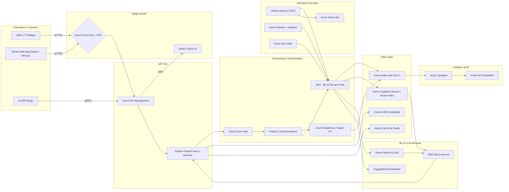
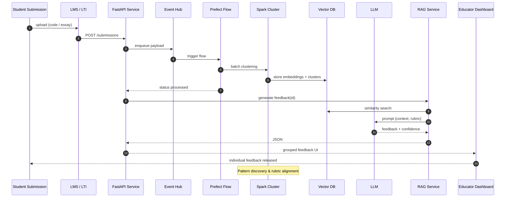

# Sense Education – Platform Architecture & Data Flow

Below are two diagrams capturing high level platform architecture and the ML/LLM feedback pipeline overview.

---

---
### Legend & Notes
* External traffic terminates at Azure Front Door (TLS + WAF).
* Prefect orchestrates event-driven pipelines; Spark handles batch clustering/analytics.
* RAG blends vector search with LLM for pedagogy-aligned feedback.

---

## ML & LLM Feedback Pipeline

